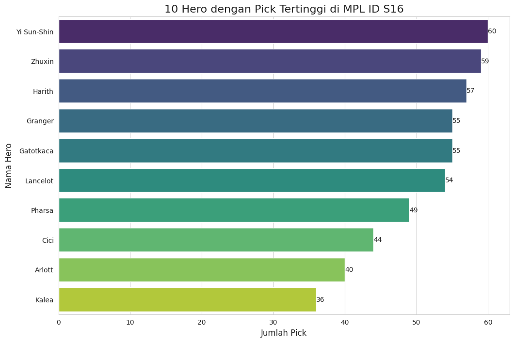
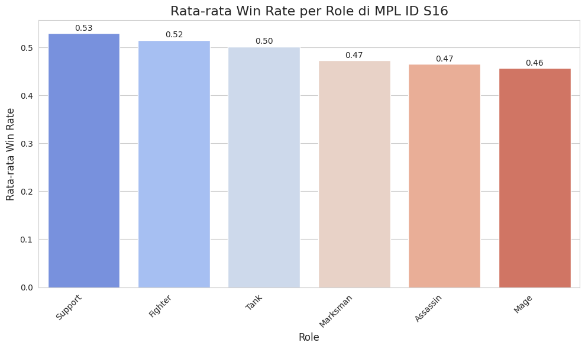
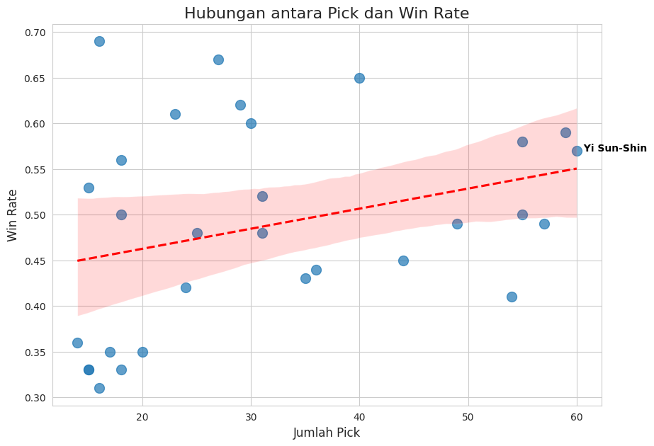
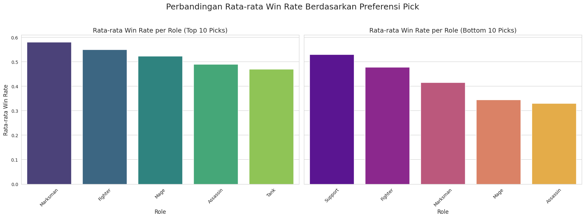

# Analisis Data MPL ID S16: Mengungkap Rahasia Meta Game dengan Data Science

* ✨ Mengungkap tren hero dengan win rate tertinggi di MPL ID S16
* 🤖 Otomasi pipeline data (pembersihan, analisis) menggunakan AI kustom
* 📊 Visualisasi data interaktif untuk wawasan strategis

## Pendahuluan
Di dunia esports Mobile Legends, setiap keputusan draft pick bisa menjadi penentu kemenangan. Proyek ini hadir untuk membongkar meta game MPL ID S16, tidak hanya berdasarkan intuisi, tetapi dengan wawasan yang didapat dari data. Saya menganalisis data dari 30 hero yang paling sering dimainkan hingga 29 September 2025. Tujuannya sederhana: mengidentifikasi hero-hero kunci dan tren strategi yang paling efektif, serta menemukan "senjata rahasia" yang terabaikan. Proses ini saya lakukan dengan sangat efisien, didukung oleh custom Gems yang secara otomatis membersihkan, menganalisis, dan memvisualisasikan data, mengubah tumpukan angka menjadi insight strategis.

## Metodologi: Proses Data-Driven yang Efisien
Proses analisis saya dimulai dengan pembersihan data. Saya menggunakan script sederhana yang terintegrasi dalam pipeline analisis untuk memastikan kolom 'Win Rate' sudah dalam format numerik. Ini adalah langkah krusial yang sering kali memakan waktu, namun berkat Gems saya, proses ini berjalan otomatis dan memastikan data siap untuk dianalisis.

## Analisis & Temuan Utama
1. Dominasi Hero di Fase Draft
* Siapa yang paling sering muncul di Land of Dawn?
Saya menganalisis hero dengan jumlah pick tertinggi di sepanjang turnamen. Dari visualisasi di bawah, terlihat hero seperti Yi Sun-Shin, Zhuxin, dan Harith menjadi langganan di tim-tim profesional. Popularitas mereka menunjukkan fleksibilitas dan pengaruh besar dalam berbagai komposisi tim.

2. Rata-rata Win Rate per Role
* Apakah ada role yang lebih superior dari yang lain?
Analisis saya menunjukkan bahwa di MPL ID S16, role Support dan Fighter memiliki rata-rata win rate tertinggi. Ini mengindikasikan bahwa hero-hero di kedua role ini memiliki dampak signifikan pada hasil pertandingan, baik melalui utility yang krusial maupun damage output yang konsisten.

3. Hubungan antara Popularitas dan Kemenangan
* Apakah hero terpopuler selalu menjadi yang terbaik?
Saat saya membandingkan jumlah pick dengan win rate menggunakan scatter plot, saya menemukan korelasi positif yang lemah (0.31). Ini adalah temuan penting! Garis regresi menunjukkan tren kenaikan yang sangat landai, membuktikan bahwa popularitas hero tidak selalu menjamin kemenangan. Tim profesional mungkin memilih hero populer karena fleksibilitas atau kenyamanan, bukan semata-mata karena win rate yang superior.

4. Kontras Antara Hero Populer dan Hero Jarang Dipilih
* Untuk mendapatkan gambaran yang lebih dalam, saya membandingkan rata-rata win rate dari 10 hero paling sering di-pick dan 10 hero paling jarang di-pick.
Hasilnya mengejutkan:
- Rata-rata win rate 10 hero terpopuler: 0.52
- Rata-rata win rate 10 hero paling jarang di-pick: 0.43
Hal ini menunjukkan adanya perbedaan performa yang signifikan. Meskipun hero-hero terpopuler cenderung memiliki win rate yang lebih tinggi, saya menemukan "mutiara tersembunyi" di antara hero yang jarang dipilih.

5. Menemukan Hero "Underestimated"
Inilah bagian yang paling menarik! Saya memfilter hero dengan jumlah pick di bawah 20 tetapi memiliki win rate di atas 55%.
Hasilnya, saya menemukan Esmeralda dan Khaleed. Esmeralda, meskipun hanya di-pick 16 kali, memiliki win rate luar biasa yaitu 69%! Sementara Khaleed mencapai 56% dari 18 kali pick.
Hipotesis mengapa hero ini jarang dipilih meskipun efektif:
- High Skill Ceiling: Mereka mungkin memerlukan mekanik yang kompleks untuk dimainkan dengan optimal.
- Situational Picks: Hero-hero ini sangat kuat hanya dalam kondisi atau komposisi tim tertentu.
- Unpopular in Meta: Mereka tidak sejalan dengan tren strategi tim yang sedang populer.
Ini adalah bukti nyata bahwa data bisa mengungkap potensi hero yang terabaikan, yang mungkin bisa menjadi senjata rahasia di tangan tim yang tepat.

## Kesimpulan & Rekomendasi Strategis
Dari analisis yang komprehensif ini, saya menarik beberapa kesimpulan kunci:
* Popularitas Bukan Jaminan Kemenangan. Tim profesional seringkali memilih hero berdasarkan faktor lain seperti fleksibilitas, keamanan, dan kenyamanan, bukan hanya win rate tertinggi.
* Adanya 'Hidden Gems'. Ada hero-hero yang sangat efektif namun jarang digunakan. Mereka bisa menjadi power pick atau counter pick yang tidak terduga, memberikan keunggulan kompetitif.

Rekomendasi Strategis:
Untuk tim dan analis esports, alih-alih hanya mengikuti hero meta, pertimbangkan untuk melatih dan menguji hero seperti Esmeralda dan Khaleed. Menguasai hero-hero ini bisa memberikan dimensi baru pada strategi tim dan mengejutkan lawan. Ini adalah contoh sempurna bagaimana data science mengubah cara kita melihat game, dari sekadar hiburan menjadi arena strategis yang diisi dengan insight-insight berharga.
